# 基于GitLab+Docker+K8S的持续集成和交付

此文档主要说明怎样基于GitLab进行持续集成和持续交付，该持续集成与交付集成了gitlab-runner 、mvnw、Docker、harbor、k8s等技术，同时展示了在k8s平台利用EFK(elasticsearch,fluentd,kibana)技术完成了集群统一日志管理，使用kube-prometheus技术进行集群实时监控以及kube-dashboard管理集群中的应用部署，为了不引入网络问题，本环境的相关VPC机器已经关闭了本机防火墙。

## 一、场景问题

- 配置应用的部署环境复杂繁琐、已经配置好的环境很难移植、存在大量重复劳动、时间成本人力成本增加，由于各种应用服务配置复杂，部署运维手册更新不及时、缺少甚至没有部署操作记录时，导致部署更加难上加难，大量时间浪费在环境部署上，应用的部署越来越需要自带依赖环境，无需或只需少量配置就能运行
- 机器资源不能有效利用、机器CPU、内存、带宽、硬盘等资源存在浪费，需要好的度量或监控方式了解实际利用率
- 应用程序可移植性和扩展性差，负载不够时需要重复部署配置，不能根据业务进行有效自动调整部署
- 运维困难、很难保证7x24小时服务稳定性和可用性，不得不增加运维人力且对运维要求颇高
- 由于机房相关环境变动或系统升级，不得不对应用服务各个方面进行检查，并修改相关配置以应对各种调整、重新部署应用速度慢、不能快速拉起应用服务
- 随着应用程序的业务规模、开发人员很难在单机上部署开发环境模拟整个业务流程，越来越需要把复杂应用拆分为微服务化，允许开发人员以微服务方式自动注册到应用中变成开发环境的一部分集中主要精力解决实际问题即self-hosting，而不是耗费大量时间在整个应用的部署上
- 日志收集排错能力会随着业务系统的复杂度越来越难控制，传统方式查找日志已经不能应对快速的应用修复和变更
- 应用服务应该具备Develop、Stage、Production三种部署范围，develop负责开发，stage负责阶段演示，production负责生产，且支持在不同的环境中快速部署切换，允许模拟在不同的网络拓扑结构下验证bug解决或功能的可行性
- 应用业务之间由于模块、项目的划分很难追踪服务之间的依赖或调用关系，程序之间的调用越来越复杂需要有清晰的方式记录、自说明这些配置，使用统一的格式管理、解析，版本控制，允许运维人员通过查看统一配置明确服务之间的调用关系，而不需要侵入代码
- 随着应用开发的多变性，依赖ACL的变更调整策略被动防御攻击反而加重了开发、运维的负担，也不能实时进行相关统计，反而需要为应用服务集群构建统一的实时监控方案，监控方案不止涉及传统操作系统的关键环节，还要监控应用服务的业务时态，支持实时分析系统之间的调用情况，允许通过实时统计评估模块、项目的质量和可用性，允许发生系统故障时迅速隔离业务或熔断调用关系，防止错误灾难迅速扩大导致其他业务不可用、并支持报警机制
- 应用系统的代码托管、版本控制、编译、测试与部署应该支持自动化，应对上传内外网安全限制策略
- 安全方面应用服务的部分漏洞导致宿主集群被攻破时，需要有能力迅速隔离感染环境，防止整个机房内部服务的感染

## 二、引入容器技术的可行性（Docker）

- 应用程序和依赖环境打包成镜像，直接运行镜像即可运行应用程序，解耦了应用程序和宿主系统，应用程序更容易移植，且不受限于应用开发依赖的特定计算机语言
- 无需担心因宿主系统版本升级、依赖库升级或部署其他相关应用，导致应用系统因版本冲突或意外覆盖问题不能运行，因为应用程序和依赖环境打包到了一起，宿主系统的环境更改不会影响运行环境 
- 镜像启动速度快轻便捷，像虚拟机一样敏捷 ，在Bare Metal或VPC上布署像点个按钮一样简单 
- 可以在docker hub/docker store 镜像市场以及第三方镜像市场寻找现成基础镜像，拉取现有镜像，免去了繁重的基础应用环境的部署配置，如：nginx，tomcat，mysql，redis，mongodb等等
- 可移植性，可在各种环境中自由迁移应用，支持内网Bare Metal，VM，和公有云VPC，易于横向自由扩展部署系统
- 安全性，进程在cgroups空间内运行犹如在沙箱中运行 ，即便应用被攻陷获取root权限，由于非真实宿主系统环境，很难伤害宿主机

## 三、引入容器编排技术的可行性（k8s--kubernetes）

- docker等容器技术解决的是单机部署、应用和依赖环境打包的可移植问题，集群中自动部署镜像需要解决
- k8s天然适合微服务的部署
- 支持通过简单命令构建镜像部署集群，将Bare Metal或VPC抽象成资源消耗，资源告急时，仅需运行简单命令即可加入集群
- 镜像自动部署到集群中无需人工干预，k8s自动监控应用存活状态，当宿主机节点由于故障原因脱离集群时，运行其上的应用就会自动转移到其他机器，无需人工干预，保证了应用程序的高可用性
- k8s内置自动负载均衡，无需为应用配置繁琐的负载均衡功能
- k8s支持自动扩容，无需人工干预，系统可根据消耗自动扩容或收缩应用
- k8s支持应用在线发布和回滚
- k8s支持内网和公有云迁移，应用部署无需修改或仅进行少量相关配置即可快速部署，k8s已经成为各大云生产商的标配
- 支持docker overlay覆盖型网络，意味着微服务可以和实际宿主机VPC网络解耦
- 有大量现成可行性方案支持集群基础能力问题，如：EFK解决统一日志收集、kube-prometheus支持集群监控等等
- 支持众多云或本地存储方案,如：GFS，CEPH、NFS等等
- 管理集群方便简洁，仅需少量人员轻松管理上百台VPC，官方在云环境下测试最高支持到5000台VPC, 平均每台上VPC运行30个pod应用

k8s的架构原理图：

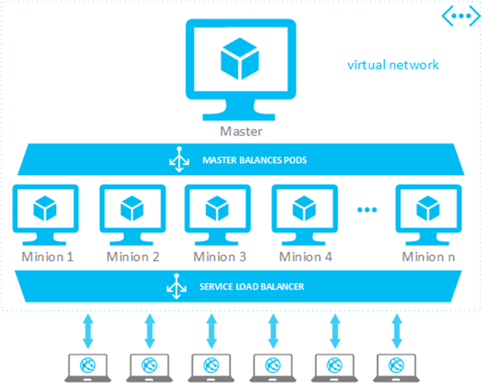

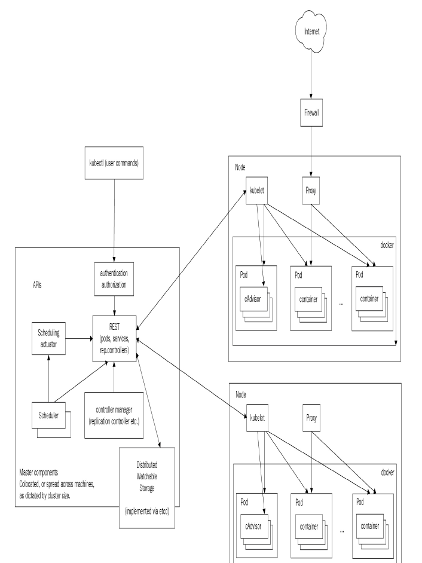

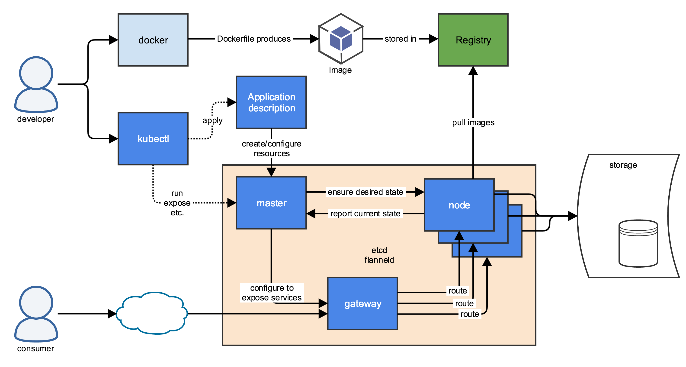


## 四、Docker安装（centos7）

- 如之前安装过移除老旧版本

```bash
sudo yum remove docker \
                  docker-client \
                  docker-client-latest \
                  docker-common \
                  docker-latest \
                  docker-latest-logrotate \
                  docker-logrotate \
                  docker-selinux \
                  docker-engine-selinux \
                  docker-engine
```

- 使用阿里镜像库安装

```bash
# Step 1: 安装必要的一些系统工具
sudo yum install -y yum-utils device-mapper-persistent-data lvm2

# Step 2: 添加软件源信息
sudo yum-config-manager --add-repo http://mirrors.aliyun.com/docker-ce/linux/centos/docker-ce.repo

# Step 3: 更新并安装 Docker-CE
sudo yum makecache fast
sudo yum -y install docker-ce

# Step 4：添加当前用户到docker组中允许普通用户运行docker命令，此步需要登出linux环境重新再登录方能生效
sudo usermod -aG docker $USER

# Step 5：添加开机启动
sudo systemctl enable docker.service

# Step 6：启动docker
sudo systemctl start docker.service

# Step 7：查看docker版本
docker version

# Step 8：验证docker环境是否能运行镜像
docker run hello-world

#运行效果如下所示：
Hello from Docker!
This message shows that your installation appears to be working correctly.

To generate this message, Docker took the following steps:
 1. The Docker client contacted the Docker daemon.
 2. The Docker daemon pulled the "hello-world" image from the Docker Hub.
    (amd64)
 3. The Docker daemon created a new container from that image which runs the
    executable that produces the output you are currently reading.
 4. The Docker daemon streamed that output to the Docker client, which sent it
    to your terminal.

To try something more ambitious, you can run an Ubuntu container with:
 $ docker run -it ubuntu bash

Share images, automate workflows, and more with a free Docker ID:
 https://hub.docker.com/

For more examples and ideas, visit:
 https://docs.docker.com/engine/userguide/


```

- 由于Docker默认是从dockerhub镜像服务市场拉取镜像，该镜像市场在国外，为了加速拉取镜像可以为其添加阿里镜像加速功能,该加速功能免费，另外阿里云支持每账号5个的免费公有镜像仓库。

  ```
   cat /etc/docker/daemon.json 
  {
     "registry-mirrors": ["https://xxxxxx.mirror.aliyuncs.com"] #可登陆阿里云根据账号配置
  }
  ```

- Docker相关命令Reference请参考如下网址

[docker 参考文档](https://docs.docker.com/get-started/)

## 五、代码托管服务GitLab安装

- 支持git分布式代码托管和版本控制，开发人员切换容易
- 安装部署简单支持docker方式部署
- 支持CI/CD
- 文档健全有现成的用例提供部署参考
- 可以解决因内网限制策略导致部署上传速度慢的问题

GitLab类似于Github，可以像Github一样本地托管代码管理团队

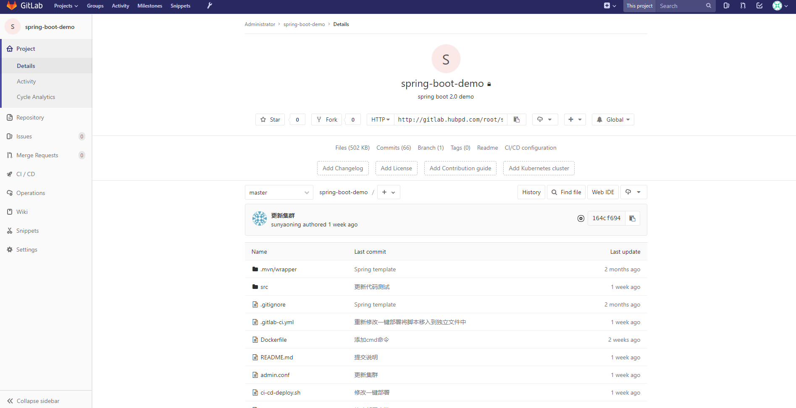

- ### 基于Docker方式安装

```
sudo docker run --detach \
    --hostname gitlab.example.com \
    --publish 443:443 --publish 80:80 --publish 22:22 \ #此处可以不配置22端口如果sshd已经占用该端口
    --name gitlab \
    --restart always \
    --volume /srv/gitlab/config:/etc/gitlab \
    --volume /srv/gitlab/logs:/var/log/gitlab \
    --volume /srv/gitlab/data:/var/opt/gitlab \
    gitlab/gitlab-ce:latest
    
#如果操作系统使用SELinux使用如下命令：
sudo docker run --detach \
    --hostname gitlab.example.com \
    --publish 443:443 --publish 80:80 --publish 22:22 \
    --name gitlab \
    --restart always \
    --volume /srv/gitlab/config:/etc/gitlab:Z \
    --volume /srv/gitlab/logs:/var/log/gitlab:Z \
    --volume /srv/gitlab/data:/var/opt/gitlab:Z \
    gitlab/gitlab-ce:latest
  
    
```

- ###  停止服务

如果由于磁盘空间不足需要增加硬盘空间,或备份托管源代码，可以采用如下命令：

```bash
#进入gitlab容器
sudo docker exec -it gitlab /bin/bash
#进入container之后停止gitlab服务
gitlab-ctl stop
#退出container之后
sudo docker stop gitlab

```

- ### gitlab-runner

gitlab-runner是gitlab的运行器，它可以根据CI/CD 配置文件[.gitlab-ci.yml](https://docs.gitlab.com/ce/ci/yaml/README.html)运行编译打包等持续集成的相关任务。

- 安装gitlab-runner

```bash
#添加gitlab-runner库
curl -L https://packages.gitlab.com/install/repositories/runner/gitlab-runner/script.rpm.sh | sudo bash

# For RHEL/CentOS/Fedora
sudo yum install gitlab-runner
```

- 注册gitlab-runner 为共享执行器

```bash
gitlab-runner register \
  --non-interactive \
  --url "http://10.30.13.2/" \ #该参数为gitlab服务器的位置
  --registration-token "F-CKeY1gKWRPxN5XL77N" \ #该以管理员身份从gitlab获取的registration token
  --executor "shell" \ #以shell方式执行任务，支持docker，docker machine，ssh 等等各种执行方式
  --docker-image alpine:3.7 \ #默认的任务镜像
  --description "gitlab-runner" \ #描述
  --tag-list "share-runner-tag" \ #标记在.gitlab-ci.yml会用到
  --run-untagged \ #可以运行在非tag代码上
  --locked="false" \ #是否锁定该执行器

```

gitlab-runner可以将VPC或本地机器变成执行器，gitlab-runner每隔3秒从gitlab拉取执行信息，根据相关指令执行相关任务。且gitlab-runner注册命令的相关配置保存在/etc/gitlab-runner/config.toml文件中,如需修改相关相关

[参考网址](https://docs.gitlab.com/runner/register/index.html)

## 六、安装harbor私有仓库

harbor为VMware开发的docker私有镜像库，具有镜像管理，人员管理以及权限管理等功能。去该github地址下载相关安装包：https://github.com/vmware/harbor/blob/master/docs/installation_guide.md，harbor支持离线安装和在线安装，由于离线包较大下载速度较慢，本环境使用了在线安装。

- 解压安装文件到/usr/local下

  ```bash
  cd /usr/local
  tar xvf harbor-online-installer-<version>.tgz
  ```

-   在/usr/local/harbor/ harbor.cfg 按照参考github相关[参考](https://github.com/vmware/harbor/blob/master/docs/installation_guide.md)配置相关参数，本环境只设置了hostname参数，如下：

  ```properties
  ## Configuration file of Harbor
  
  #This attribute is for migrator to detect the version of the .cfg file, DO NOT MODIFY!
  _version = 1.5.0
  #The IP address or hostname to access admin UI and registry service.
  #DO NOT use localhost or 127.0.0.1, because Harbor needs to be accessed by external clients.
  hostname = 10.30.13.1
  ```

- 由于harbor启动需要依赖docker-compose工具启动相关镜像，故如果环境没有docker-compose的话需要安装一下，执行如下命令安装docker-compose：

  ```bash
  sudo pip install docker-compose
  ```

- 进入/usr/local/harbor/ 目录，执行如下命令，在线安装harbor：

  ```
  sudo ./install.sh
  ```

- 安装成功后即可在访问宿主机地址进行查看，如下图所示：

  1.登录页面：

  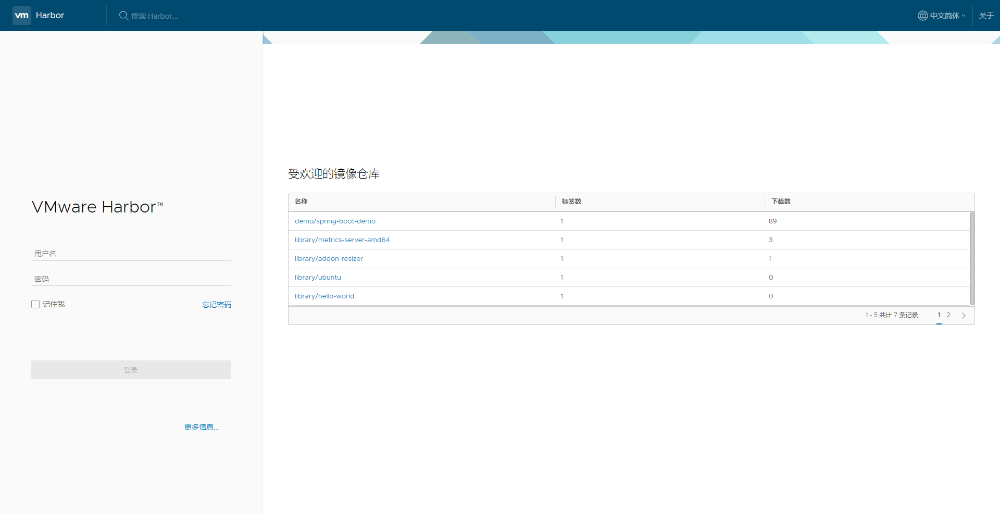

  2.管理页面

  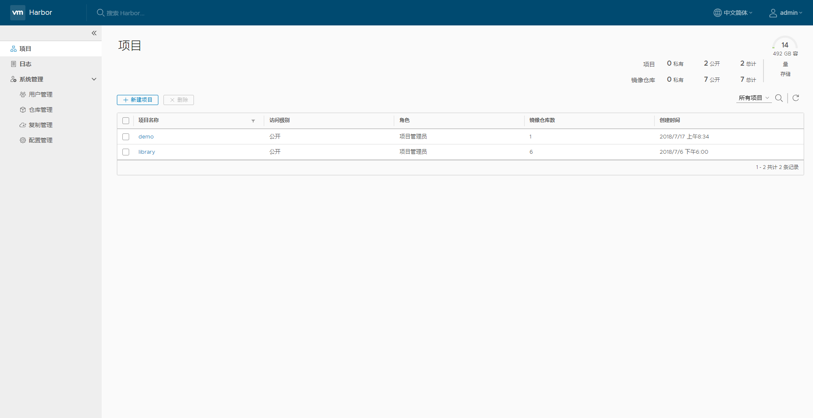

- 进入/usr/local/harbor/ 目录，停止harbor

  ```bash
  sudo docker-compose stop
  ```

-   进入/usr/local/harbor/ 目录， 停止后再启动harbor

  ```bash
  sudo docker-compose start
  ```

- 如要修改harbor的相关参数，使用如下命令步骤

  ```bash
  sudo docker-compose down -v
  vim harbor.cfg
  sudo prepare
  sudo docker-compose up -d
  ```

-   harbor默认80端口，如需修改端口，参考如下方式：

  ```
  1. 修改 docker-compose.yml
  
  proxy:
      image: library/nginx:1.11.5
      restart: always
      volumes:
        - ./config/nginx:/etc/nginx
      ports:
        - 8888:80 #8888为最终要修改的端口，修改该位置即可
        - 443:443
      depends_on:
        - mysql
        - registry
        - ui
        - log
      logging:
        driver: "syslog"
        options:
          syslog-address: "tcp://127.0.0.1:1514"
          tag: "proxy"
  
  2. 修改 harbor.cfg
  hostname = 192.168.0.2:8888
  ```

  

- 由于harbor使用http协议通信，docker默认使用https协议拉取镜像，docker支持http方式需要按如下步骤进行配置：

  ```shell
  #For centos or repl
  sudo systemctl edit --full  docker.service 
  
  #添加如下参数
  ExecStart=/usr/bin/dockerd --insecure-registry=10.30.13.1 #添加harbor的仓库地址
  
  #执行如下命令
  sudo  systemctl daemon-reload
  sudo  systemctl restart docker
  
  #登录私有仓库
  docker login  -u  admin  -p xxxx  10.30.13.1
  
  #推送镜像
  docker pull 10.30.13.1/library/demo:v1
  ```

  

 *注意*：因为本环境仅做为内网开发使用，目前没有添加Notary 和Clair 功能，Notary和Clair分别提供镜像签名和扫描镜像相关漏洞使用，如需要做成公网镜像可以进行相关配置。

## 七、安装Glusterfs

Glusterfs为readhat公司开发的开源分布式文件系统，支持9种不懂的分布式文件部署需求，满足集群中分布式文件的高性能、高可用和简单扩容能力，硬盘扩容仅需采用LVM技术在机器中加入新硬盘或新分区即可轻松扩容空间，Glusterfs默认采用XFS文件系统，这也是Centos7默认的文件系统格式，最大可支持的文件大 小为9 exabytes（即9x1024x1024T），最大文件系统尺寸为18 exabytes（即18x1024x1024T），所以Glusterfs可以为k8集群提供充裕的磁盘空间。

本环境因为资源所限，紧使用了两台VPC模拟了**Replicated Glusterfs Volume** 部署方式，原理图如下所示：


为了防止脑裂问题，建议采用3台VPC。安装部署如下：

- GFS服务端安装

```shell
#分别为两个VPC设置hostname，分别为server1，和server2
#第一台VPC执行
sudo hostnamectl set-hostname server1
#第二台VPC执行
sudo hostnamectl set-hostname server2

#分别在两台机器上执行如下命令
#安装依赖包
sudo yum install centos-release-gluster

#为vps添加硬盘(官方建议在新硬盘和分区上使用GFS，但也可以在根分区下使用)，并格式化
sudo mkfs.xfs -i size=512 /dev/sdb1

#创建挂载目录
sudo mkdir -p /bricks/brick1

sudo vi /etc/fstab
#为fstab文件自动挂载记录:
/dev/sdb1 /bricks/brick1 xfs defaults 1 2

#保存文件执行如下命令
sudo mount -a && mount

#安装集群
sudo  yum install glusterfs-server

#允许gfs开机启动
sudo systemctl enable glusterd

#启动gfs服务
sudo systemctl enable glusterd

#检查gfs运行状态
sudo systemctl status glusterd

#创建trusted pool
#在server1执行如下命令
sudo gluster peer probe server2
#在server2执行如下命令
sudo gluster peer probe server1

#在所有机器上分别执行如下命令
sudo mkdir -p /bricks/brick1/gv0
sudo gluster volume create gv0 replica 2 server1:/bricks/brick1/gv0 server2:/bricks/brick1/gv0 force
sudo gluster volume start gv0

#启动卷
sudo gluster volume start gv0

#查看卷状态信息
sudo gluster volume info

#查看卷的详细信息
sudo gluster volume status gv0 detail
```

- GFS客户端安装

```shell
#安装相关依赖包
sudo yum install -y centos-release-gluster
sudo yum install -y glusterfs-server
sudo yum install -y glusterfs
```

- 挂载并测试卷

```shell
#挂载卷
mount -t glusterfs server1:/gv0 /mnt 

#测试卷
for i in `seq -w 1 100`; do cp -rp /var/log/messages /mnt/copy-test-$i; done

#执行如下命令查看文件是否生成
ls -lA /mnt | wc -l

#使用fstab开机自动挂载卷
vi /etc/fstab
server1:/test-volume /mnt/glusterfs glusterfs defaults,_netdev 0 0

```

- 卷的管理参考

  https://gluster.readthedocs.io/en/latest/Administrator%20Guide/Managing%20Volumes/

## 八、安装NFS

 NFS可以将一台VPC变成文件存储环境，但是因为不易于扩展原因，单靠NFS在高负载高性能的要求下不适合分布式集群使用，但依然有其使用场景，如：用其作为日志或临时统计分析存储方案或者对单点要求不太重要的存储场合，目前k8s支持挂载NFS文件系统

- 服务端安装

  ```bash
  #安装相关依赖包
  sudo yum -y install nfs-utils
  
  #修改相关配置
  sudo vi /etc/idmapd.conf
  Domain = srv.world #你的hostname
  
  #修改挂载限制规则
  sudo vi /etc/exports
  /home 10.0.0.0/24(rw,no_root_squash)
  ```

- 客户端安装

  ```shell
  #安装依赖包
  sudo yum -y install nfs-utils
  
  #修改相关配置
  vi /etc/idmapd.conf
  Domain = srv.world
  
  #启动nfs相关服务
  sudo systemctl start rpcbind
  #允许开机启动服务 
  sudo systemctl enable rpcbind
  
  #挂载nfs卷
  mount -t nfs dlp.srv.world:/home /home
  
  #查看挂载情况
  df -hT
  
  #允许fstab开机启动自动挂载
  vi /etc/fstab
  dlp.srv.world:/home  /home                   nfs     defaults        0 0
  
  #如通过autofs自动挂载非fstab
  #解决fstab配置众多挂载项导致客户端开机启动慢或由于依赖启动顺序不能出现挂载问题，
  #可修改autofs相关配置文件
  sudo vi /etc/auto.mount
  /mntdir -fstype=nfs,rw  dlp.srv.world:/home
  #创建自动挂载目录
  mkdir /mntdir
  #启动autofs服务
  systemctl start autofs
  #开机启动autofs服务
  systemctl enable autofs
  #查看autofs自动挂载情况
  cat /proc/mounts | grep mntdir
  ```

## 九、安装k8s集群

Kubernetes是Google开源的Docker容器集群管理系统，为容器化的应用提供资源调度、部署运行、服务发现、扩容缩容等整一套功能 ，本环境采用了四台VPC完成了集群环境的搭建，其中一台master节点，三台node节点。

- k8s集群搭建环境配置

```bash
#各个VPC需要安装Docker，请参考Docker的安装策略

#为各VPC添加hostname，本环境分别为master，node1，node2，node3

#在各VPC机器下执行如下命令

#使用阿里源镜像安装k8s
#安装yum源库
cat <<EOF > /etc/yum.repos.d/kubernetes.repo
[kubernetes]
name=Kubernetes
baseurl=https://mirrors.aliyun.com/kubernetes/yum/repos/kubernetes-el7-x86_64/
enabled=1
gpgcheck=1
repo_gpgcheck=1
gpgkey=https://mirrors.aliyun.com/kubernetes/yum/doc/yum-key.gpg https://mirrors.aliyun.com/kubernetes/yum/doc/rpm-package-key.gpg
EOF

#关闭SELinux
sudo setenforce 0
#修改/etc/selinux/config
SELINUX=disabled

#安装依赖库
sudo yum install -y kubelet kubeadm kubectl git conntrack
sudo systemctl enable kubelet

#允许ip转发
sudo sysctl net.bridge.bridge-nf-call-iptables=1
#修改/etc/sysctl.conf:
net.ipv4.ip_forward = 1

#开启
sudo cat <<EOF >  /etc/sysctl.d/k8s.conf
net.bridge.bridge-nf-call-ip6tables = 1
net.bridge.bridge-nf-call-iptables = 1
EOF

#查看转发设置是否成功
sudo sysctl --system

#查看cgroup驱动是否一致
docker info | grep -i cgroup
sudo cat /etc/systemd/system/kubelet.service.d/10-kubeadm.conf
#如果不一致，修改如下文件
sed -i "s/cgroup-driver=systemd/cgroup-driver=cgroupfs/g" /etc/systemd/system/kubelet.service.d/10-kubeadm.conf
#如修改了10-kubeadm.conf需要执行如下命令使其生效
sudo systemctl daemon-reload
sudo systemctl restart kubelet
sudo systemctl stop kubelet

##关闭交换分区
swapoff -a
#注释 /etc/fstab 有swap分区的一行
```

- 采用kubadm方式启动k8s 集群 mater主机

```bash
sudo kubeadm init --apiserver-advertise-address=10.30.5.1  --kubernetes-version=1.11.0 --pod-network-cidr=10.244.0.0/16  --token-ttl=0
```

master主机启动后会有如下输出：

```shell
Your Kubernetes master has initialized successfully!

To start using your cluster, you need to run the following as a regular user:

  mkdir -p $HOME/.kube
  sudo cp -i /etc/kubernetes/admin.conf $HOME/.kube/config
  sudo chown $(id -u):$(id -g) $HOME/.kube/config

You should now deploy a pod network to the cluster.
Run "kubectl apply -f [podnetwork].yaml" with one of the options listed at:
  https://kubernetes.io/docs/concepts/cluster-administration/addons/

You can now join any number of machines by running the following on each node
as root:

  kubeadm join 10.30.5.1:6443 --token uzsv39.e2d48u4i1wgfw532 --discovery-token-ca-cert-hash sha256:73b8ef1a9ed85b489387abd8f1e6bffb7d7a4e0410f2511bb515b3be3d03b727

```

如果想普通用户使用k8s集群，可以运行master的输出命令，如下命令支持普通用户登录系统后可以管理k8s：

```shell
 mkdir -p $HOME/.kube
 sudo cp -i /etc/kubernetes/admin.conf $HOME/.kube/config
 sudo chown $(id -u):$(id -g) $HOME/.kube/config
```

如仅需root用户管理集群，可以运行如下命令（为了管理方便可以将其加入到~/.bashrc文件中，这样每次登陆master主机时即可自动加载命令）：

```shell
export KUBECONFIG=/etc/kubernetes/admin.conf
```

因为k8s命令繁多，可以使用如下方式为k8s的kubectl命令添加自动提示功能：

```shell
#为k8s添加自动提示
echo "source <(kubectl completion bash)" >> ~/.bashrc
```

- 为k8s集群建立docker overlay网络，本环境使用flannel网络实现方案，运行如下命令即可安装网络环境，

```
 kubectl apply -f kube-flannel.yml 
```

flannel 实现了容器overlay网络功能，其基本思想类似nat技术，实现原理如下：

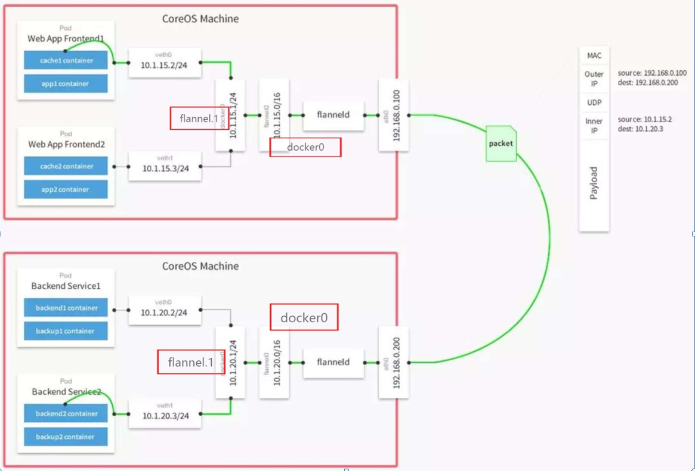

由于k8s自带dns功能，再结合overlay网络，集群内服务可以像internet域名一样为自己命名，k8s自动通过内置dns为相关服务调用解析为内部overlay网络ip，从而解耦了宿主环境的ip环境。

参考地址：

https://github.com/coreos/flannel

- 在其他节点中运行如下命令即可加入k8s集群

```shell
kubeadm join 10.30.5.1:6443 --token uzsv39.e2d48u4i1wgfw532 --discovery-token-ca-cert-hash sha256:73b8ef1a9ed85b489387abd8f1e6bffb7d7a4e0410f2511bb515b3be3d03b727
```

输出效果如下：

```
[root@node1 ~]# kubeadm join 10.30.5.1:6443 --token uzsv39.e2d48u4i1wgfw532 --discovery-token-ca-cert-hash sha256:73b8ef1a9ed85b489387abd8f1e6bffb7d7a4e0410f2511bb515b3be3d03b727
[preflight] running pre-flight checks
I0802 13:55:41.353849   20648 kernel_validator.go:81] Validating kernel version
I0802 13:55:41.353994   20648 kernel_validator.go:96] Validating kernel config
	[WARNING SystemVerification]: docker version is greater than the most recently validated version. Docker version: 18.03.1-ce. Max validated version: 17.03
[discovery] Trying to connect to API Server "10.30.5.1:6443"
[discovery] Created cluster-info discovery client, requesting info from "https://10.30.5.1:6443"
[discovery] Requesting info from "https://10.30.5.1:6443" again to validate TLS against the pinned public key
[discovery] Cluster info signature and contents are valid and TLS certificate validates against pinned roots, will use API Server "10.30.5.1:6443"
[discovery] Successfully established connection with API Server "10.30.5.1:6443"
[kubelet] Downloading configuration for the kubelet from the "kubelet-config-1.11" ConfigMap in the kube-system namespace
[kubelet] Writing kubelet configuration to file "/var/lib/kubelet/config.yaml"
[kubelet] Writing kubelet environment file with flags to file "/var/lib/kubelet/kubeadm-flags.env"
[preflight] Activating the kubelet service
[tlsbootstrap] Waiting for the kubelet to perform the TLS Bootstrap...
[patchnode] Uploading the CRI Socket information "/var/run/dockershim.sock" to the Node API object "node1" as an annotation

This node has joined the cluster:
* Certificate signing request was sent to master and a response
  was received.
* The Kubelet was informed of the new secure connection details.

Run 'kubectl get nodes' on the master to see this node join the cluster.

```

在mater下可以运行如下命令查看目前集群的状态，如下所示：

```shell
[root@master1 ~]# kubectl get nodes 
NAME      STATUS    ROLES     AGE       VERSION
master1   Ready     master    37m       v1.11.0
node1     Ready     <none>    15m       v1.11.0
node2     Ready     <none>    33s       v1.11.0
node3     Ready     <none>    30s       v1.11.0

```

- 停止集群

```shell
#在master节点停止相关服务
kubectl delete deploy 服务名称
#清理集群其他附属服务
kubectl drain <node name> --delete-local-data --force --ignore-daemonsets
kubectl delete node --all
kubeadm reset
#所有node节点执行如下命令
kubeadm reset
```

- 参考网址

  k8s api参考网址：

  https://kubernetes.io/docs/reference/generated/kubernetes-api/v1.11/

  kubectl命令参考网址：

  https://kubernetes.io/docs/reference/generated/kubectl/kubectl-commands

  官网参考文档地址：

  https://kubernetes.io/

- 该环境采用的k8s版本为v1.11 ，该环境涉及的相关镜像如下（包括dashboard、metrics-server、heapster、EFK、prometheus-operator、kube-prometheus）：

  ```bash
  
  ```

  > 注意：由于GWF问题，某些镜像需要通过科学上网技术自行下载

## 十、Gitlab+Docker+k8s持续集成部署

集成部署原理图如下图所示：


- gitlab负责代码托管

- git客户端推送代码到gitlab

- gitlab-runner负责从gitlab上获取任务并执行任务，执行任务如果有附属产品如：jar，war或者其他静态文件，可反传回gitlab以备下载或下次任务时使用

- gitlab-runner在执行任务时可以调用docker工具完成应用程序的打包，并将打包好的镜像推送到私有仓库harbor

- k8s集群并行拉取镜像自动部署相关应用程序

  以下为演示demo的.gitlab-ci.ym任务运行内容，如下图所示：

  ```yaml
  stages:
    - compile
    - package
    - deploy
    
  variables:
    #JAVA_IMAGE: java:8
  mvn-build:
    stage: compile
    script: ./mvnw clean package
    allow_failure: false
    only:
    - master
    when: manual
    artifacts:
      paths:
        - target/demo-0.0.1-SNAPSHOT.jar
     
  docker-pkg:
    stage: package
    before_script: 
    - docker login -u admin -p Pdmi1234! 10.30.13.1
    script: 
    - docker build  -t 10.30.13.1/demo/spring-boot-demo .
    - docker push 10.30.13.1/demo/spring-boot-demo
    allow_failure: false
    dependencies: 
    - mvn-build
    only:
    - master
    when: manual
    retry: 2
  
  k8s-deploy:
    stage: deploy
    before_script: 
    - mkdir -p $HOME/.kube
    - cp -f ./admin.conf $HOME/.kube/config
    script: 
    - sh ./ci-cd-deploy.sh
    allow_failure: false
    dependencies: 
    - docker-pkg
    only:
    - master
    when: manual
    retry: 2 
  
  ```

  该脚本可以编译打包一个spring-boot项目，并直接部署到k8s平台，过程类似其他CI/CD工具，编译分为三个阶段：编译、打包和部署。其中mvnw负责编译java程序，docker负责打包镜像文件和推送到harbor私有库，k8s通过读取项目下的  [**k8s-deploy.yml**](http://10.30.13.2/root/spring-boot-demo/blob/master/k8s-deploy.yml)文件，自动部署到集群中。

  

## 十一、安装k8s dashboard

dashboard 是k8s的web UI管理平台，可以通过web方式管理集群，查看集群中用应用的部署情况。

该项目参考如下网址：https://github.com/kubernetes/dashboard

- 在k8s master节点运行如下命令安装dashboard

  ```
  [root@master1 ~]# kubectl apply -f k8s-install/dashboark/
  clusterrolebinding.rbac.authorization.k8s.io/admin-user created
  serviceaccount/admin-user created
  secret/kubernetes-dashboard-certs created
  serviceaccount/kubernetes-dashboard created
  role.rbac.authorization.k8s.io/kubernetes-dashboard-minimal created
  rolebinding.rbac.authorization.k8s.io/kubernetes-dashboard-minimal created
  deployment.apps/kubernetes-dashboard created
  service/kubernetes-dashboard created
  
  ```

- 获取web UI访问token，执行如下命令：

  ```
  kubectl -n kube-system describe secret $(kubectl -n kube-system get secret | grep admin-user | awk '{print $1}')
  
  ```

- 打开浏览器，输入网址，本环境根据需要将dashboard服务暴露成nodeport方式，端口为30001，初次登录如下图所示：

  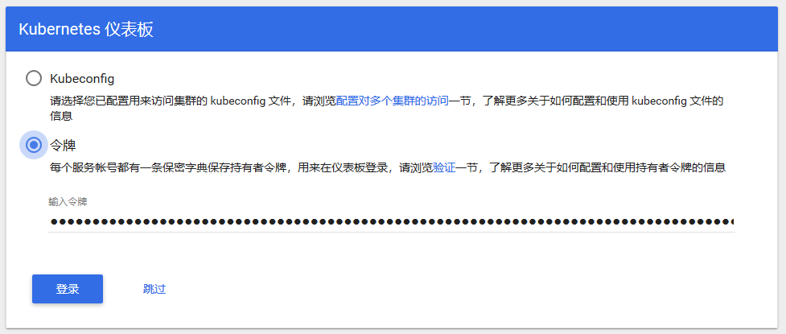

  输入tocken值即可进入dashboard管理页面，如下图所示：

  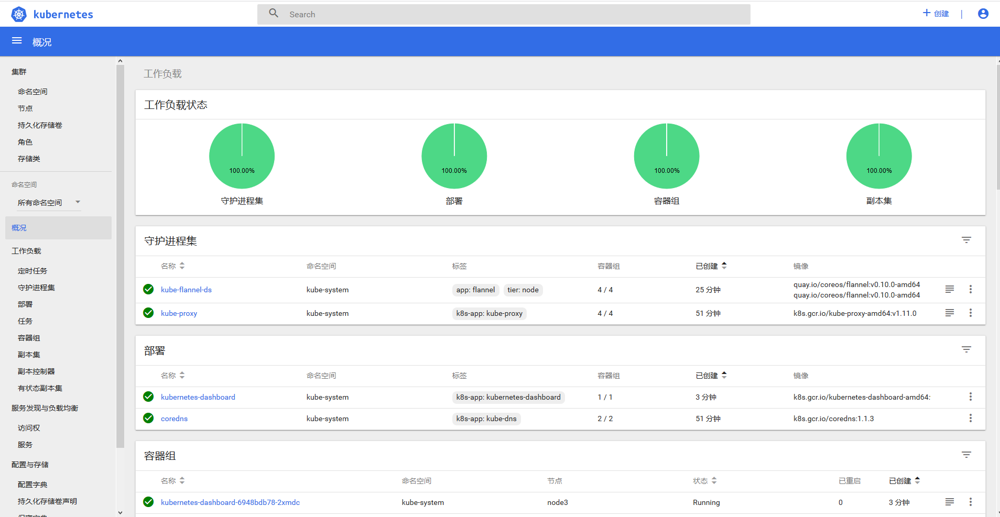

  该平台可以查看集群的工作负载、节点、存储、副本集、任务、日志等等相关k8s资源情况，在线管理应用部署

## 十二、安装EFK统一日志收集

在集群中日志查看和收集通常是个棘手的问题，在k8s环境中非常易于实现日志的统一收集，其基本原理采用的是sidecar模式，在每个节点上运行daemonset(采集日志的代理)，集中收集日志到一个存储服务内然后再统一管理显示。本环境采用了kubernetes官方建议技术EFK，其中EFK分别代表elasticsearch,fluentd,kibana，fluentd负责统一采集日志，elasticsearch集中收集聚合运算日志，kibana负责UI显示，由于简单起见我们没有加入权限管理。

该程序的架构思维如下：


在k8s master运行如下命令：

```shell
[root@master1 ~]# kubectl apply -f k8s-efk-log/
service/elasticsearch-logging created
serviceaccount/elasticsearch-logging created
clusterrole.rbac.authorization.k8s.io/elasticsearch-logging created
clusterrolebinding.rbac.authorization.k8s.io/elasticsearch-logging created
statefulset.apps/elasticsearch-logging created
configmap/fluentd-es-config-v0.1.4 created
serviceaccount/fluentd-es created
clusterrole.rbac.authorization.k8s.io/fluentd-es created
clusterrolebinding.rbac.authorization.k8s.io/fluentd-es created
daemonset.apps/fluentd-es-v2.2.0 created
deployment.apps/kibana-logging created
service/kibana-logging created
[root@master1 ~]# 

```

由于访问方便，该日志服务采用nodeport方式部署，运行效果如下：

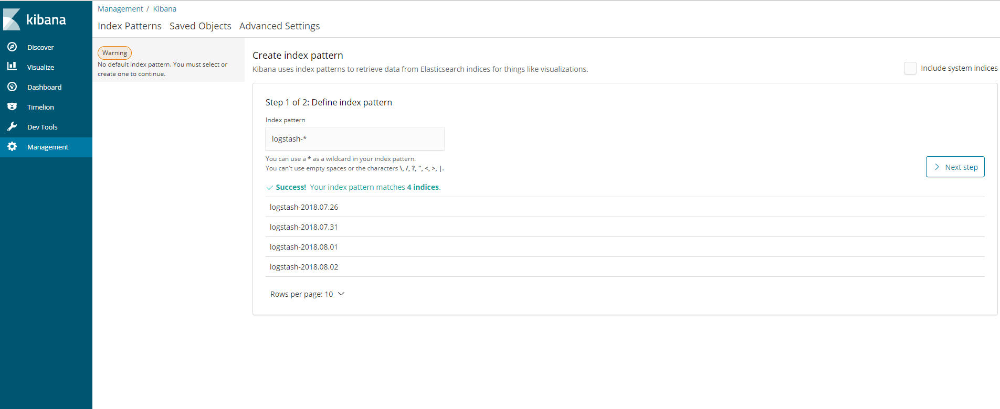

初次登录需要配置要检索的elasticsearch索引，默认我们采用logstash-*模式匹配默认索引，点击“Next step”为其配置时间过滤器，如下图所示：

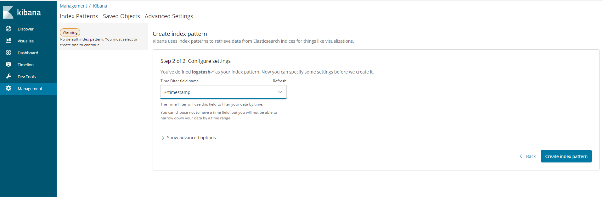

点击“Create Index Pattern”，进入如下页面，意味着可以通过不通字段，搜集相关日志：

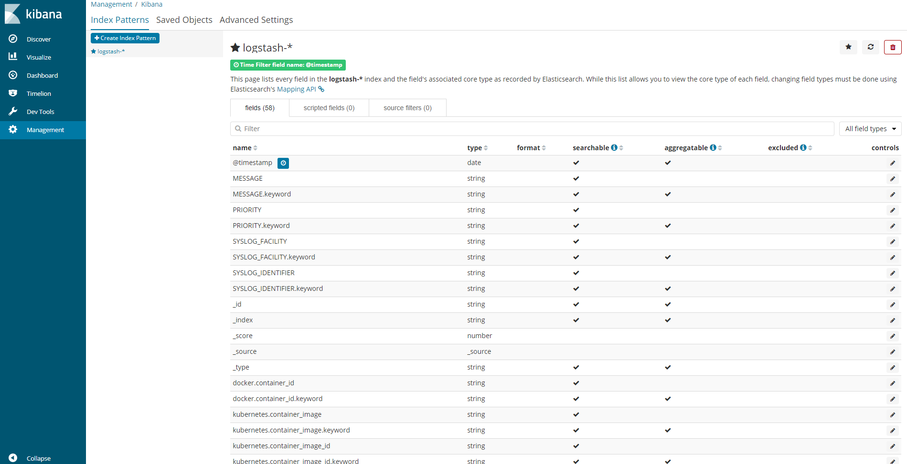

点击左侧的“Dicover”即可搜集相关日志，如下图所示：

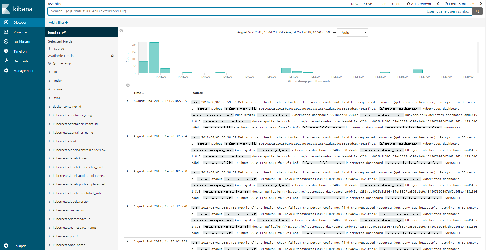

## 十三、安装kube-prometheus集群监控

集群监控是个棘手的问题，传统方式采用[**Zabbix**](https://www.zabbix.com/) 等技术方案很难达到一种统一集中监控集群的方式，kube-prometheus基于prometheus-operator提供了一套现成的采集形式，同时支持WebUI显示、用户管理和报警功能，参考网址：https://github.com/coreos/prometheus-operator/tree/master/contrib/kube-prometheus。

默认情况下k8s为了减少资源消耗是没有开通集群资源统计情况的，需要为各节点修改如下参数，开启集群资源统计功能：

```shell
sudo vi /etc/systemd/system/kubelet.service.d/10-kubeadm.conf

#为kubelet添加如下参数：
ExecStart=/usr/bin/kubelet $KUBELET_KUBECONFIG_ARGS $KUBELET_CONFIG_ARGS $KUBELET_KUBEADM_ARGS $KUBELET_EXTRA_ARGS --authentication-token-webhook --authorization-mode=Webhook --read-only-port=10255

#注意以下三个参数是追加的参数
--authentication-token-webhook --authorization-mode=Webhook  --read-only-port=10255


```

该程序的架构思维如下：


执行如下命令即可轻松安装集群监控，如下所示：

```
 kubectl apply -f kube-prometheus/manifests/
```

由于访问方便，我们采用了nodeport暴露服务，端口使用30002，访问网址如下所示：


第一次登录需要为admin用户设置密码，登录完成后，如下图所示：

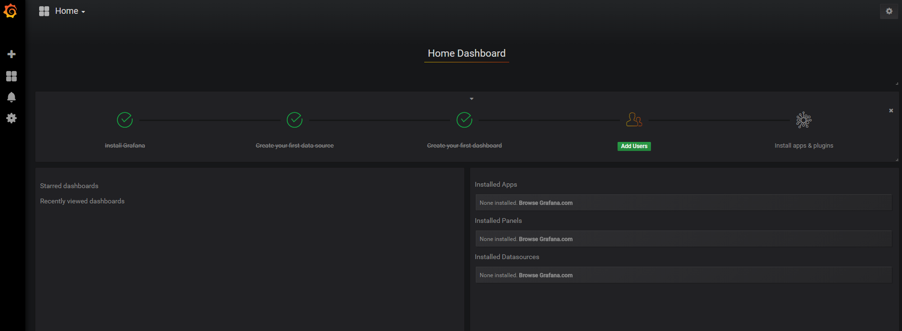

点击左侧导航“Manage”可以查看可监控项，如下图所示：

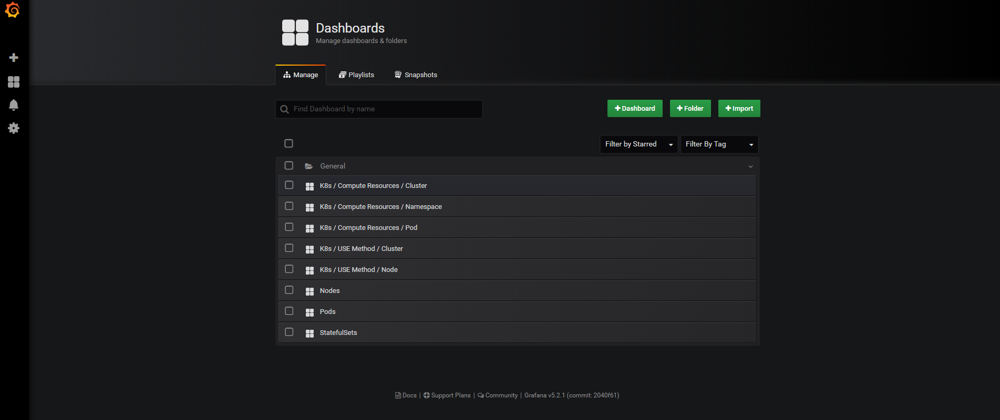

我们可以从集群资源消耗情况，命名空间、pod使用情况，node节点情况等等分别观察集群的健康状况。如下图所示：

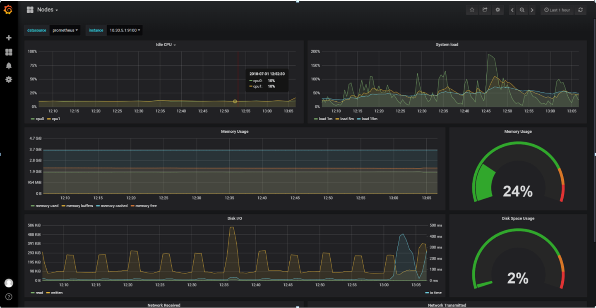